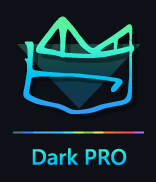

# Monden PRO Dark Blue Zen VS Code Color Theme
<!-- Improved compatibility of back to top link: See: https://github.com/othneildrew/Best-README-Template/pull/73 -->

<!-- PROJECT LOGO -->
 

  

  <h3 align="center">Monden PRO Dark Blue Zen - BETA - Not Final</h3>

  

    A Dark Theme that's both good for your eyes and looks great. Designed by a Graphic/Web Design PRO.
  

<!-- TABLE OF CONTENTS -->

  
Table of Contents

  <ol>
    <li><a href="#about-the-project">About Dark PRO</a></li>
    <li><a href="#features">Features</a></li>
    <li><a href="#screenshots">Screenshots</a></li>
    <li><a href="#license">License</a></li>
    <li><a href="#contact">Contact</a></li>
  </ol>

<!-- ABOUT THE PROJECT -->
## About The Project
Color theme (<a href="https://github.com/draganmilenkovic/Monden_PRO_Dark_Blue_Zen">Monden PRO Dark Blue Zen</a>) for VS Code is just a first in a collection-to-be of eye-washing, polished-looking VS Code color themes.

<!-- FEATURES -->
## Features:

Monden PRO Dark Blue Zen theme strikes the center of beautiful colors and eye-care, creating a perfect dark theme for your next 20.000 hours in front of the screen.
* Built by a Monokai scheme fan and battle-tested Graphic Design & Coding PRO
* Built with goal to create the perfect balance between vivid colors and eye-care.
* Instantly elevates your code highlighting.
* Specific targeting for several coding languages.

(<a href="#readme-top">back to top</a>)

<!-- SCREENSHOTS -->
## Screenshots

#### JS - Dark PRO Blue X-Deep

#### CSS - Dark PRO Blue Zen

#### PHP - Dark PRO Blue X-Deep

#### HTML - Dark PRO Blue X-Deep

(<a href="#readme-top">back to top</a>)

<!-- LICENSE -->
## License

Distributed under the MIT License. See `LICENSE.txt` for more information.

<!-- PROJECT LINK -->
## Contact

Project Link: [https://github.com/draganmilenkovic/Monden_PRO_Dark_Blue_Zen](https://github.com/draganmilenkovic/Monden_PRO_Dark_Blue_Zen)

(<a href="#readme-top">back to top</a>)
